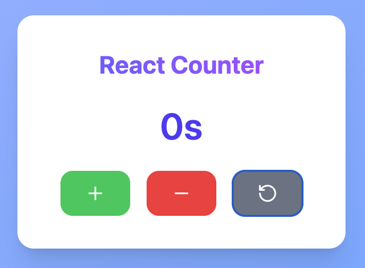

# React Counter App

A simple and beautiful counter application built with React and Tailwind CSS.  
This app allows users to increment, decrement, and reset a counter with a clean UI and smooth UX.

---

## 🎯 Features

- Increment the counter by 1  
- Decrement the counter by 1  
- Reset the counter to zero  
- Responsive and visually appealing design using Tailwind CSS  
- Uses icons from [lucide-react](https://lucide.dev/) for buttons  

---

## 💻 Technologies Used

- React (Functional Components & Hooks)  
- Tailwind CSS (for styling)  
- lucide-react (for icons)  

---

## 🖼 Screenshot




---

## 📦 Installation & Setup Instructions

1. **Clone the repository**

   ```bash
   git clone https://github.com/rafikakhatun/react-counter-app.git
   cd react-counter-app
